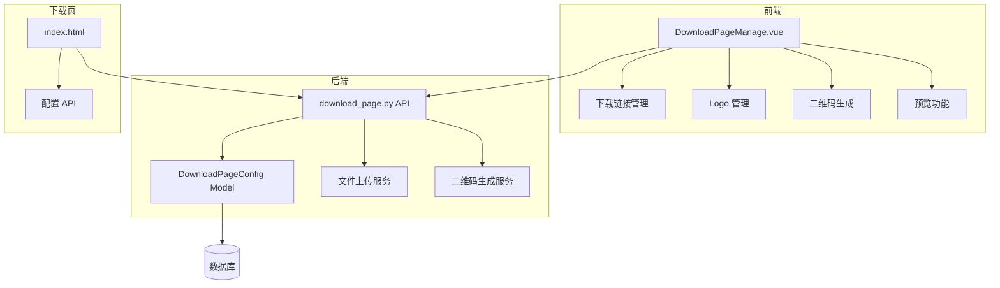

# 设计文档

## 概述

下载页管理功能采用前后端分离架构，后端使用 FastAPI 提供 RESTful API，前端使用 Vue 3 + Element Plus 构建管理界面。配置数据存储在数据库中，下载页通过 API 动态获取配置。

## 架构



## 组件与接口

### 后端 API 接口

#### 1. 获取下载页配置
```
GET /api/v1/download-page/config
Response: {
  "download": {
    "android": [
      {"url": "string", "name": "string", "is_primary": bool, "is_active": bool}
    ],
    "ios": {
      "appstore": "string",
      "mobileconfig": "string"
    }
  },
  "logos": {
    "pc": "string",
    "mobile": "string"
  },
  "backgrounds": {
    "v1": {"pc": "string", "mobile": "string"},
    "v2": {"pc": "string", "mobile": "string"}
  },
  "qrcode": {
    "url": "string",
    "logo": "string",
    "color": "string",
    "size": int
  }
}
```

#### 2. 更新下载页配置（管理员）
```
PUT /api/v1/admin/download-page/config
Body: DownloadPageConfigUpdate
Response: {"message": "更新成功"}
```

#### 3. 上传图片（Logo/背景）
```
POST /api/v1/admin/download-page/upload
Body: FormData (file, type: logo_pc|logo_mobile|bg_pc|bg_mobile)
Response: {"url": "string"}
```

#### 4. 生成二维码
```
POST /api/v1/admin/download-page/qrcode
Body: {"url": "string", "logo": "string", "color": "string", "size": int}
Response: {"image": "base64 string"}
```

#### 5. 上传 APK 安装包
```
POST /api/v1/download-page/admin/upload-apk
Body: FormData (file: APK 文件)
Response: {
  "url": "string",           // 下载 URL
  "filename": "string",      // 文件名
  "size": int,               // 文件大小（字节）
  "size_mb": float           // 文件大小（MB）
}
```

#### 6. 删除 APK 文件
```
DELETE /api/v1/download-page/admin/apk/{filename}
Response: {"message": "删除成功"}
```

### 前端组件

#### DownloadPageManage.vue
主管理页面，包含以下功能区：
- 下载链接管理区（表格 + 表单）
- Logo 管理区（上传组件）
- 二维码生成区（预览 + 下载）
- 背景图管理区（上传组件）
- 预览按钮

### 数据库配置键

复用 `system_configs` 表，使用 `download_page` 分组：

| 配置键 | 描述 |
|--------|------|
| download_android_links | Android 下载链接 JSON |
| download_ios_appstore | iOS App Store 链接 |
| download_ios_mobileconfig | iOS mobileconfig 链接 |
| download_logo_pc | PC 端 Logo URL |
| download_logo_mobile | 移动端 Logo URL |
| download_bg_v1_pc | V1 背景 PC 端 |
| download_bg_v1_mobile | V1 背景移动端 |
| download_bg_v2_pc | V2 背景 PC 端 |
| download_bg_v2_mobile | V2 背景移动端 |
| download_qrcode_url | 二维码目标 URL |
| download_qrcode_logo | 二维码中心 Logo |
| download_qrcode_color | 二维码颜色 |
| download_qrcode_size | 二维码尺寸 |

## 数据模型

### Android 下载链接结构
```typescript
interface AndroidLink {
  id: string;
  name: string;        // 链接名称，如"主下载"、"备用1"
  url: string;         // 下载地址
  is_primary: boolean; // 是否主链接
  is_active: boolean;  // 是否启用
  sort_order: number;  // 排序
}
```

### iOS 下载链接结构
```typescript
interface IOSLinks {
  appstore: string;      // App Store 链接
  mobileconfig: string;  // mobileconfig 链接
  appstore_active: boolean;
  mobileconfig_active: boolean;
}
```

### 二维码配置结构
```typescript
interface QRCodeConfig {
  url: string;      // 目标 URL
  logo?: string;    // 中心 Logo URL
  color: string;    // 前景色，默认 #000000
  size: number;     // 尺寸，默认 300
}
```

### 完整配置结构
```typescript
interface DownloadPageConfig {
  android_links: AndroidLink[];
  ios_links: IOSLinks;
  logos: {
    pc: string;
    mobile: string;
  };
  backgrounds: {
    v1: { pc: string; mobile: string };
    v2: { pc: string; mobile: string };
  };
  qrcode: QRCodeConfig;
  active_bg_version: 'v1' | 'v2';
}
```

## 正确性属性

*正确性属性是指在系统所有有效执行中都应保持为真的特征或行为——本质上是关于系统应该做什么的形式化陈述。属性作为人类可读规范和机器可验证正确性保证之间的桥梁。*

### Property 1: 配置保存与读取一致性
*对于任意* 有效的下载页配置对象，保存到数据库后再读取，应该得到等价的配置对象（round-trip 属性）。
**验证: 需求 5.1, 5.2**

### Property 2: 链接启用状态正确性
*对于任意* 下载链接，当其 `is_active` 设置为 false 时，该链接不应出现在公开 API 返回的活跃链接列表中。
**验证: 需求 1.4**

### Property 3: 图片上传格式验证
*对于任意* 上传的图片文件，如果其格式不在支持列表（PNG、JPG、WebP）中，系统应拒绝上传并返回错误。
**验证: 需求 2.5**

### Property 4: 二维码生成确定性
*对于任意* 相同的二维码配置（URL、Logo、颜色、尺寸），生成的二维码图片内容应该相同。
**验证: 需求 3.1**

### Property 5: Android 链接优先级排序
*对于任意* Android 链接列表，返回的链接应按 `sort_order` 升序排列，主链接（is_primary=true）应排在最前。
**验证: 需求 1.6**

### Property 6: APK 文件格式验证
*对于任意* 上传的文件，如果其扩展名不是 `.apk`，系统应拒绝上传并返回错误。
**验证: 需求 7.5**

## 错误处理

| 错误场景 | 处理方式 |
|---------|---------|
| 图片格式不支持 | 返回 400，提示支持的格式 |
| 图片超过大小限制 | 返回 400，提示大小限制（2MB） |
| APK 格式不正确 | 返回 400，提示只支持 APK 格式 |
| APK 超过大小限制 | 返回 400，提示大小限制（200MB） |
| APK 文件不存在 | 返回 404，提示文件不存在 |
| 配置保存失败 | 返回 500，回滚事务，保持原配置 |
| 二维码生成失败 | 返回 500，提示重试 |
| 未授权访问 | 返回 401/403 |

## 测试策略

### 单元测试
- 配置序列化/反序列化测试
- 图片格式验证测试
- 链接排序逻辑测试

### 属性测试
- **Property 1**: 使用 Hypothesis 生成随机配置对象，验证 round-trip
- **Property 2**: 生成随机链接列表，验证禁用链接过滤
- **Property 3**: 生成各种文件类型，验证格式校验
- **Property 4**: 生成相同配置多次，验证输出一致性
- **Property 5**: 生成随机链接列表，验证排序正确性

### 集成测试
- API 端到端测试
- 文件上传流程测试
- 前端组件交互测试

### 测试框架
- 后端: pytest + hypothesis（属性测试）
- 前端: Vitest + Vue Test Utils
