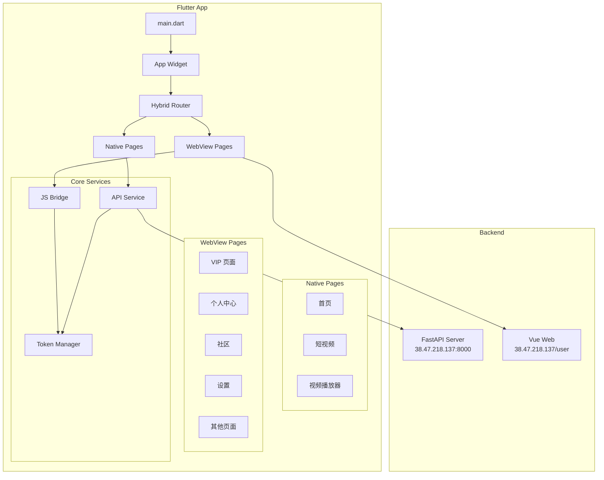
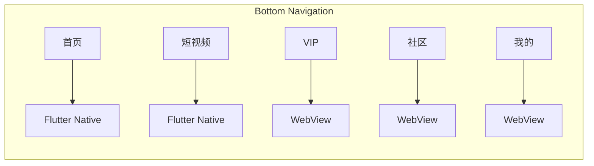
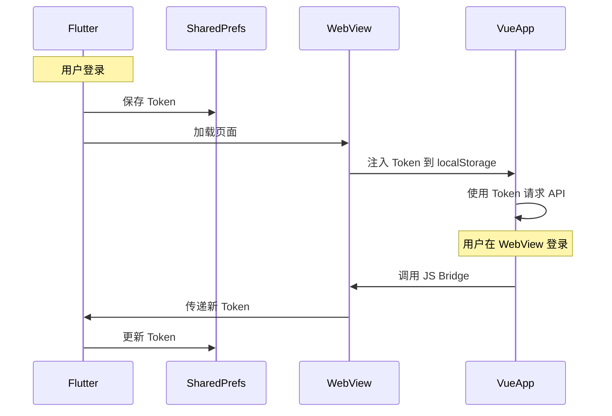

# Design Document: Flutter + WebView 混合方案

## Overview

本设计文档描述了 Flutter + WebView 混合方案移动端 App 的技术架构和实现细节。该方案将性能关键的页面（首页、短视频、视频播放器）使用 Flutter 原生实现，而复杂功能页面（VIP、个人中心、社区等）通过 WebView 加载现有 Vue 网页，实现功能复用和开发效率的平衡。

核心技术栈：
- Flutter 3.x + Dart
- webview_flutter 包用于 WebView 集成
- video_player + chewie 用于视频播放
- Provider 用于状态管理
- Dio 用于网络请求

## Architecture

### 整体架构图



### 页面路由架构



### Token 同步流程



## Components and Interfaces

### 1. 核心服务层

#### ApiService（已存在，需扩展）

```dart
/// API 服务 - 处理所有后端 API 请求
class ApiService {
  static const String baseUrl = 'http://38.47.218.137:8000/api/v1';
  static const String serverUrl = 'http://38.47.218.137:8000';
  static const String webUrl = 'http://38.47.218.137';
  
  // 现有方法保持不变
  static Future<Response> get(String path, {Map<String, dynamic>? params});
  static Future<Response> post(String path, {dynamic data});
  static Future<void> setToken(String token);
  static String? getToken();
  
  // 新增：获取 WebView 页面完整 URL
  static String getWebPageUrl(String path) {
    if (path.startsWith('http')) return path;
    return '$webUrl$path';
  }
}
```

#### TokenManager

```dart
/// Token 管理器 - 负责 Flutter 和 WebView 之间的 Token 同步
class TokenManager {
  static final TokenManager _instance = TokenManager._internal();
  factory TokenManager() => _instance;
  TokenManager._internal();
  
  final _tokenController = StreamController<String?>.broadcast();
  Stream<String?> get tokenStream => _tokenController.stream;
  
  /// 获取当前 Token
  String? get currentToken => ApiService.getToken();
  
  /// 设置 Token（同时通知所有监听者）
  Future<void> setToken(String token) async {
    await ApiService.setToken(token);
    _tokenController.add(token);
  }
  
  /// 清除 Token
  Future<void> clearToken() async {
    await ApiService.clearToken();
    _tokenController.add(null);
  }
  
  /// 生成注入 Token 的 JavaScript 代码
  String generateTokenInjectionScript() {
    final token = currentToken;
    if (token == null) return '';
    return '''
      localStorage.setItem('token', '$token');
      localStorage.setItem('access_token', '$token');
    ''';
  }
}
```

#### JSBridge

```dart
/// JavaScript 桥接 - 处理 Flutter 和 WebView 之间的双向通信
class JSBridge {
  final WebViewController controller;
  final Function(String route, Map<String, dynamic>? params)? onNavigate;
  final Function(String token)? onTokenUpdate;
  final Function(Map<String, dynamic> data)? onShare;
  
  JSBridge({
    required this.controller,
    this.onNavigate,
    this.onTokenUpdate,
    this.onShare,
  });
  
  /// 初始化 JS Bridge
  Future<void> init() async {
    // 注入 Flutter 调用接口
    await controller.addJavaScriptChannel(
      'FlutterBridge',
      onMessageReceived: _handleMessage,
    );
  }
  
  /// 处理来自 WebView 的消息
  void _handleMessage(JavaScriptMessage message) {
    final data = jsonDecode(message.message);
    final action = data['action'];
    
    switch (action) {
      case 'navigate':
        onNavigate?.call(data['route'], data['params']);
        break;
      case 'updateToken':
        onTokenUpdate?.call(data['token']);
        break;
      case 'share':
        onShare?.call(data['data']);
        break;
      case 'getDeviceInfo':
        _sendDeviceInfo();
        break;
    }
  }
  
  /// 调用 WebView 中的 JavaScript 方法
  Future<void> callJS(String method, [Map<String, dynamic>? params]) async {
    final paramsJson = params != null ? jsonEncode(params) : '{}';
    await controller.runJavaScript('window.$method && window.$method($paramsJson)');
  }
  
  /// 发送设备信息到 WebView
  Future<void> _sendDeviceInfo() async {
    final deviceInfo = {
      'platform': Platform.isIOS ? 'ios' : 'android',
      'deviceId': ApiService.getDeviceId(),
      'appVersion': '1.0.0',
    };
    await callJS('onDeviceInfo', deviceInfo);
  }
}
```

### 2. 路由层

#### HybridRouter

```dart
/// 混合路由器 - 管理原生页面和 WebView 页面的导航
class HybridRouter {
  /// 路由映射表
  static final Map<String, RouteConfig> _routes = {
    // 原生页面
    '/home': RouteConfig(type: RouteType.native, builder: (_) => const MainScreen()),
    '/shorts': RouteConfig(type: RouteType.native, builder: (_) => const ShortsScreen()),
    '/video': RouteConfig(type: RouteType.native, builder: (args) => VideoPlayerScreen(videoId: args['videoId'])),
    '/search': RouteConfig(type: RouteType.native, builder: (_) => const SearchScreen()),
    '/login': RouteConfig(type: RouteType.native, builder: (_) => const LoginScreen()),
    
    // WebView 页面
    '/vip': RouteConfig(type: RouteType.webview, webPath: '/user/vip'),
    '/profile': RouteConfig(type: RouteType.webview, webPath: '/user/profile'),
    '/community': RouteConfig(type: RouteType.webview, webPath: '/user/community'),
    '/settings': RouteConfig(type: RouteType.webview, webPath: '/user/settings'),
    '/history': RouteConfig(type: RouteType.webview, webPath: '/user/history'),
    '/favorites': RouteConfig(type: RouteType.webview, webPath: '/user/favorites'),
    '/recharge': RouteConfig(type: RouteType.webview, webPath: '/user/recharge'),
    '/invite': RouteConfig(type: RouteType.webview, webPath: '/user/invite'),
    '/service': RouteConfig(type: RouteType.webview, webPath: '/user/service'),
  };
  
  /// 导航到指定路由
  static Future<T?> navigateTo<T>(
    BuildContext context,
    String route, {
    Map<String, dynamic>? params,
  }) async {
    final config = _routes[route];
    if (config == null) {
      throw RouteNotFoundException(route);
    }
    
    if (config.type == RouteType.native) {
      return Navigator.push<T>(
        context,
        MaterialPageRoute(builder: (_) => config.builder!(params ?? {})),
      );
    } else {
      return Navigator.push<T>(
        context,
        MaterialPageRoute(
          builder: (_) => WebViewPage(
            url: ApiService.getWebPageUrl(config.webPath!),
            title: config.title,
          ),
        ),
      );
    }
  }
}

enum RouteType { native, webview }

class RouteConfig {
  final RouteType type;
  final Widget Function(Map<String, dynamic> args)? builder;
  final String? webPath;
  final String? title;
  
  RouteConfig({required this.type, this.builder, this.webPath, this.title});
}
```

### 3. WebView 组件

#### WebViewPage

```dart
/// WebView 页面容器
class WebViewPage extends StatefulWidget {
  final String url;
  final String? title;
  final bool showAppBar;
  final bool enablePullToRefresh;
  
  const WebViewPage({
    super.key,
    required this.url,
    this.title,
    this.showAppBar = true,
    this.enablePullToRefresh = true,
  });
  
  @override
  State<WebViewPage> createState() => _WebViewPageState();
}

class _WebViewPageState extends State<WebViewPage> {
  late WebViewController _controller;
  late JSBridge _jsBridge;
  bool _isLoading = true;
  bool _hasError = false;
  int _loadingProgress = 0;
  
  @override
  void initState() {
    super.initState();
    _initWebView();
  }
  
  void _initWebView() {
    _controller = WebViewController()
      ..setJavaScriptMode(JavaScriptMode.unrestricted)
      ..setNavigationDelegate(NavigationDelegate(
        onPageStarted: (_) => setState(() { _isLoading = true; _hasError = false; }),
        onPageFinished: (_) => _onPageLoaded(),
        onProgress: (progress) => setState(() => _loadingProgress = progress),
        onWebResourceError: (_) => setState(() { _hasError = true; _isLoading = false; }),
      ))
      ..loadRequest(Uri.parse(widget.url));
    
    _jsBridge = JSBridge(
      controller: _controller,
      onNavigate: _handleNavigation,
      onTokenUpdate: _handleTokenUpdate,
    );
    _jsBridge.init();
  }
  
  Future<void> _onPageLoaded() async {
    // 注入 Token
    final script = TokenManager().generateTokenInjectionScript();
    if (script.isNotEmpty) {
      await _controller.runJavaScript(script);
    }
    setState(() => _isLoading = false);
  }
  
  void _handleNavigation(String route, Map<String, dynamic>? params) {
    HybridRouter.navigateTo(context, route, params: params);
  }
  
  void _handleTokenUpdate(String token) {
    TokenManager().setToken(token);
  }
  
  @override
  Widget build(BuildContext context) {
    return Scaffold(
      appBar: widget.showAppBar ? AppBar(
        title: Text(widget.title ?? ''),
        actions: [
          if (_isLoading)
            Padding(
              padding: const EdgeInsets.all(16),
              child: SizedBox(
                width: 20, height: 20,
                child: CircularProgressIndicator(strokeWidth: 2),
              ),
            ),
        ],
      ) : null,
      body: Stack(
        children: [
          WebViewWidget(controller: _controller),
          if (_isLoading)
            LinearProgressIndicator(value: _loadingProgress / 100),
          if (_hasError)
            _buildErrorWidget(),
        ],
      ),
    );
  }
  
  Widget _buildErrorWidget() {
    return Center(
      child: Column(
        mainAxisAlignment: MainAxisAlignment.center,
        children: [
          Icon(Icons.error_outline, size: 64, color: Colors.red),
          SizedBox(height: 16),
          Text('页面加载失败'),
          SizedBox(height: 16),
          ElevatedButton(
            onPressed: () => _controller.reload(),
            child: Text('重试'),
          ),
        ],
      ),
    );
  }
}
```

### 4. 主界面

#### MainScreen

```dart
/// 主界面 - 包含底部导航栏
class MainScreen extends StatefulWidget {
  const MainScreen({super.key});
  
  @override
  State<MainScreen> createState() => _MainScreenState();
}

class _MainScreenState extends State<MainScreen> {
  int _currentIndex = 0;
  
  // 页面列表（使用 IndexedStack 保持状态）
  final List<Widget> _pages = [
    const HomePage(),           // 首页 - Flutter 原生
    const ShortsScreen(),       // 短视频 - Flutter 原生
    const WebViewPage(url: 'http://38.47.218.137/user/vip', showAppBar: false),      // VIP - WebView
    const WebViewPage(url: 'http://38.47.218.137/user/community', showAppBar: false), // 社区 - WebView
    const WebViewPage(url: 'http://38.47.218.137/user/profile', showAppBar: false),   // 我的 - WebView
  ];
  
  @override
  Widget build(BuildContext context) {
    return Scaffold(
      body: IndexedStack(
        index: _currentIndex,
        children: _pages,
      ),
      bottomNavigationBar: BottomNavigationBar(
        currentIndex: _currentIndex,
        onTap: (index) => setState(() => _currentIndex = index),
        type: BottomNavigationBarType.fixed,
        selectedItemColor: AppTheme.primaryColor,
        unselectedItemColor: Colors.grey,
        items: const [
          BottomNavigationBarItem(icon: Icon(Icons.home), label: '首页'),
          BottomNavigationBarItem(icon: Icon(Icons.play_circle), label: '短视频'),
          BottomNavigationBarItem(icon: Icon(Icons.diamond), label: 'VIP'),
          BottomNavigationBarItem(icon: Icon(Icons.people), label: '社区'),
          BottomNavigationBarItem(icon: Icon(Icons.person), label: '我的'),
        ],
      ),
    );
  }
}
```

## Data Models

### 视频模型（已存在）

```dart
class Video {
  final int id;
  final String title;
  final String? description;
  final String? coverUrl;
  final String? hlsUrl;
  final String? videoUrl;
  final int viewCount;
  final int likeCount;
  final int commentCount;
  final int favoriteCount;
  final bool isVipOnly;
  final String? uploaderName;
  final String? uploaderAvatar;
  final DateTime? createdAt;
  
  // 构造函数和 fromJson 方法
}
```

### 路由配置模型

```dart
class RouteConfig {
  final RouteType type;
  final Widget Function(Map<String, dynamic> args)? builder;
  final String? webPath;
  final String? title;
  
  RouteConfig({
    required this.type,
    this.builder,
    this.webPath,
    this.title,
  });
}

enum RouteType { native, webview }
```

### JS Bridge 消息模型

```dart
class JSBridgeMessage {
  final String action;
  final Map<String, dynamic>? data;
  
  JSBridgeMessage({required this.action, this.data});
  
  factory JSBridgeMessage.fromJson(Map<String, dynamic> json) {
    return JSBridgeMessage(
      action: json['action'],
      data: json['data'],
    );
  }
  
  Map<String, dynamic> toJson() => {
    'action': action,
    'data': data,
  };
}
```


## Correctness Properties

*A property is a characteristic or behavior that should hold true across all valid executions of a system—essentially, a formal statement about what the system should do. Properties serve as the bridge between human-readable specifications and machine-verifiable correctness guarantees.*

### Property 1: Navigation Index Consistency

*For any* navigation index in the range [0, 4], when the user taps on that navigation item, the currentIndex should equal the tapped index and the corresponding page should be displayed.

**Validates: Requirements 1.2**

### Property 2: Page State Preservation

*For any* sequence of navigation index changes, when returning to a previously visited page, the page state (scroll position, form inputs, etc.) should be preserved.

**Validates: Requirements 1.4**

### Property 3: Category Filter Parameter Correctness

*For any* category ID, when the user selects that category, the API request should include the correct categoryId parameter.

**Validates: Requirements 2.3**

### Property 4: Video Card Navigation Correctness

*For any* video with a valid ID, when the user taps on the video card, the app should navigate to the video player screen with the correct videoId parameter.

**Validates: Requirements 2.6**

### Property 5: Shorts Playback State Management

*For any* video index change in the shorts player, the current video should be playing and all other videos should be paused.

**Validates: Requirements 3.3**

### Property 6: Shorts Preload and Memory Management

*For any* current video index, videos at index-1 and index+1 should be preloaded, and video controllers at distance > 2 from current index should be disposed.

**Validates: Requirements 3.4, 3.9**

### Property 7: Play/Pause Toggle Correctness

*For any* video playback state (playing or paused), tapping the video should toggle the state to the opposite value.

**Validates: Requirements 3.5**

### Property 8: Video Information Display Completeness

*For any* video data containing title, uploader info, like count, and comment count, the UI should display all these fields.

**Validates: Requirements 3.6, 4.6**

### Property 9: Token Storage and Injection Round-Trip

*For any* valid token string, storing the token and then generating the injection script should produce a script that contains the original token value.

**Validates: Requirements 6.1, 6.2**

### Property 10: Token Clear Correctness

*For any* stored token, after calling clearToken(), the getToken() method should return null.

**Validates: Requirements 6.5**

### Property 11: JS Bridge Message Serialization Round-Trip

*For any* JSBridgeMessage object, serializing to JSON and then deserializing should produce an equivalent object.

**Validates: Requirements 7.6**

### Property 12: Route Type Determination Correctness

*For any* route path in the route mapping table, the router should correctly identify whether it's a native route or a webview route.

**Validates: Requirements 8.2, 8.3**

### Property 13: WebView URL Mapping Correctness

*For any* webview route path, the router should return the correct full URL with the server base URL prepended.

**Validates: Requirements 12.1-12.6**

### Property 14: API Request Token Header

*For any* API request when a token is stored, the request headers should contain the Authorization header with the Bearer token format.

**Validates: Requirements 13.6**

## Error Handling

### 网络错误处理

| 错误类型 | 处理方式 |
|---------|---------|
| 连接超时 | 显示"网络连接超时"提示，提供重试按钮 |
| 网络不可用 | 显示"无网络连接"提示，监听网络恢复 |
| 401 未授权 | 清除 Token，跳转登录页面 |
| 403 禁止访问 | 显示"无权限访问"提示 |
| 404 资源不存在 | 显示"内容不存在"提示 |
| 500 服务器错误 | 显示"服务器繁忙"提示，提供重试按钮 |

### WebView 错误处理

| 错误类型 | 处理方式 |
|---------|---------|
| 页面加载失败 | 显示错误页面，提供重试按钮 |
| JavaScript 执行错误 | 记录日志，不影响页面显示 |
| SSL 证书错误 | 显示安全警告（生产环境应使用 HTTPS） |

### 视频播放错误处理

| 错误类型 | 处理方式 |
|---------|---------|
| 视频加载失败 | 显示错误信息和重试按钮 |
| 播放器初始化失败 | 显示"播放器初始化失败"，提供重试 |
| HLS 流不可用 | 尝试备用视频源，或显示错误 |

### JS Bridge 错误处理

```dart
void _handleMessage(JavaScriptMessage message) {
  try {
    final data = jsonDecode(message.message);
    // 处理消息...
  } catch (e) {
    debugPrint('JS Bridge 消息解析失败: $e');
    // 返回错误信息给 WebView
    _sendError('MESSAGE_PARSE_ERROR', e.toString());
  }
}
```

## Testing Strategy

### 测试框架

- **单元测试**: flutter_test
- **属性测试**: dart_quickcheck 或 glados
- **Widget 测试**: flutter_test
- **集成测试**: integration_test

### 单元测试

单元测试用于验证具体示例和边界情况：

1. **TokenManager 测试**
   - 测试 Token 存储和读取
   - 测试 Token 清除
   - 测试注入脚本生成

2. **HybridRouter 测试**
   - 测试路由映射表完整性
   - 测试原生路由导航
   - 测试 WebView 路由导航
   - 测试参数传递

3. **JSBridge 测试**
   - 测试消息解析
   - 测试导航消息处理
   - 测试 Token 更新消息处理

4. **ApiService 测试**
   - 测试 URL 拼接
   - 测试请求头设置
   - 测试错误处理

### 属性测试

属性测试用于验证通用属性，每个测试至少运行 100 次迭代：

```dart
// Feature: flutter-webview-hybrid, Property 9: Token Storage and Injection Round-Trip
test('Token storage and injection round-trip', () {
  forAll(arbitrary<String>().where((s) => s.isNotEmpty), (token) {
    TokenManager().setToken(token);
    final script = TokenManager().generateTokenInjectionScript();
    expect(script.contains(token), isTrue);
  });
});

// Feature: flutter-webview-hybrid, Property 11: JS Bridge Message Serialization Round-Trip
test('JS Bridge message serialization round-trip', () {
  forAll(arbitrary<JSBridgeMessage>(), (message) {
    final json = message.toJson();
    final restored = JSBridgeMessage.fromJson(json);
    expect(restored.action, equals(message.action));
    expect(restored.data, equals(message.data));
  });
});

// Feature: flutter-webview-hybrid, Property 12: Route Type Determination Correctness
test('Route type determination correctness', () {
  forAll(elements(HybridRouter.routes.keys.toList()), (route) {
    final config = HybridRouter.routes[route];
    if (config!.type == RouteType.native) {
      expect(config.builder, isNotNull);
    } else {
      expect(config.webPath, isNotNull);
    }
  });
});
```

### Widget 测试

1. **BottomNavigation 测试**
   - 测试导航项数量
   - 测试点击切换

2. **WebViewPage 测试**
   - 测试加载状态显示
   - 测试错误状态显示

3. **ShortsScreen 测试**
   - 测试视频列表渲染
   - 测试滑动切换

### 集成测试

1. **登录流程测试**
   - 游客注册 → 登录 → Token 同步

2. **混合导航测试**
   - 原生页面 → WebView 页面 → 返回

3. **Token 同步测试**
   - Flutter 登录 → WebView 页面验证 Token

### 测试覆盖目标

- 单元测试覆盖率: > 80%
- 属性测试: 所有 14 个正确性属性
- Widget 测试: 所有主要组件
- 集成测试: 核心用户流程
